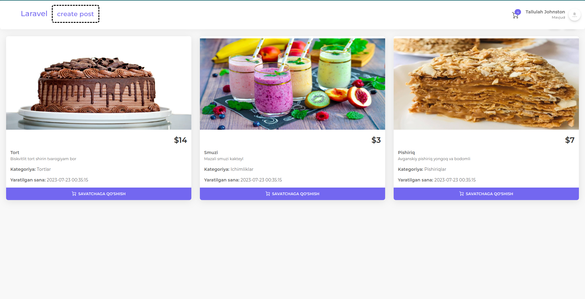
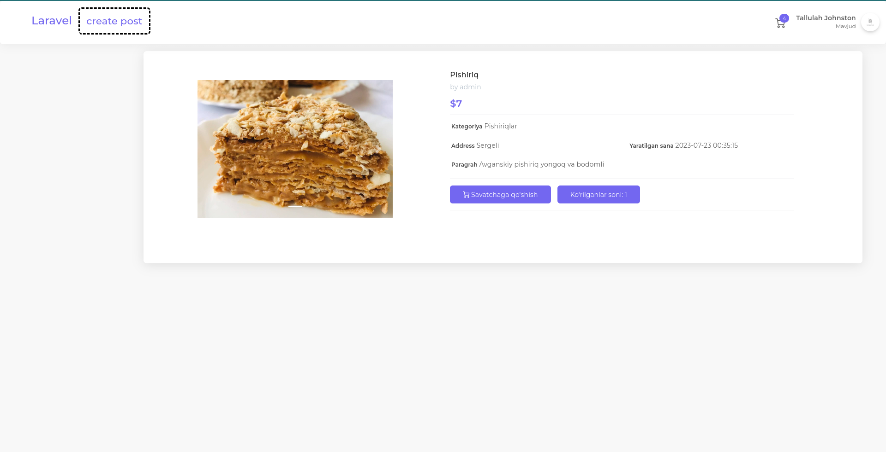
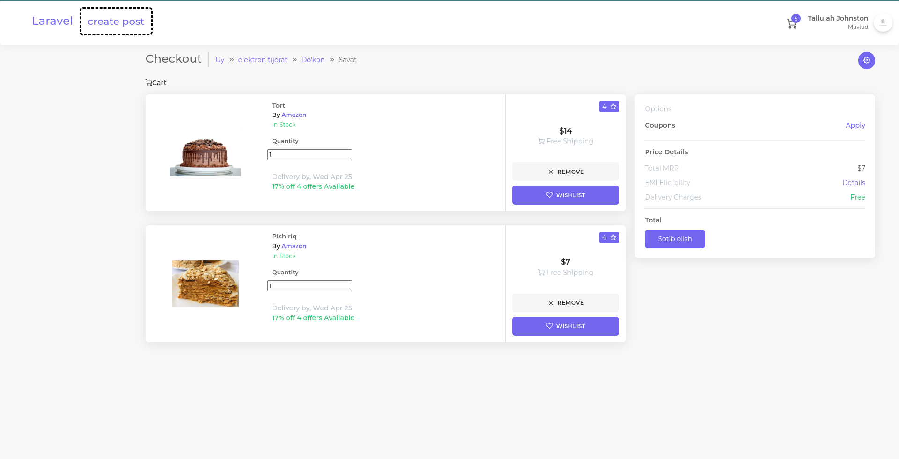

## Tortlar

## Tortlar

## Tortlar

## ishlatish
ishlatish

1) OsPanel -> domains ga put
2) Ospanel -> dapalnitelno -> kansol
3) kansol -> composer update
4)  cp .env.example .env
5) database -> database.sqlite
6) .env -> da database connection mysql ni sqlite qlsh
7) php artisan key:generate
8) php artisan migrate 
9)  php artisan serve

